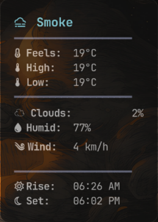
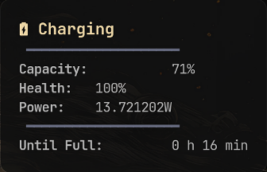
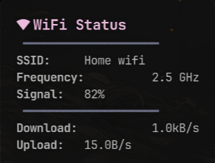
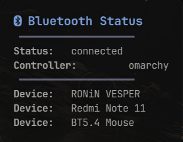
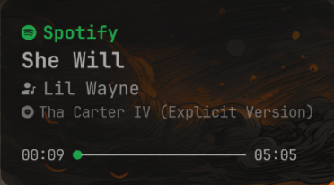
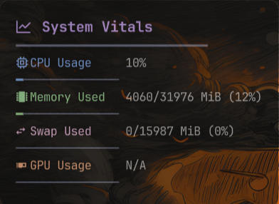

<h1 align="center">
  <br>
  
  <br>
  ✨ Omarchy Waybar ✨
</h1>

<p align="center">
  <i align="center">A high-performance, glassmorphism-inspired Waybar configuration for Hyprland.</i>
</p>

<p align="center">
  
  
  
  
</p>

<div align="center">
  <a href="#-features">Features</a> •
  <a href="#-interactive-installer">Installation</a> •
  <a href="#-tooltips">Gallery</a> •
  <a href="#-dependencies">Dependencies</a> •
  <a href="#-customization">Customization</a>
</div>

---

## 🎨 Design Philosophy

**Omarchy Waybar** isn't just a status bar; it's a dashboard for your desktop. Built with a focus on **Glassmorphism**, it features:
- 🧊 **Refined Transparency**: 70% opacity with subtle border glows.
- 🌈 **Adaptive Accents**: Colors that shift based on your active media (Spotify Green, etc.).
- 🛠️ **Functional Tooltips**: Every icon hides a mini-dashboard with detailed system insights.

---

## ✨ Features

### 🚀 Modern & Interactive Installer
Our custom-built `install.sh` provides a terminal-based UI experience:
- **Auto-Backup**: Your old configs are safely timestamped and archived.
- **Dependency Guard**: Scans your system for required tools before starting.
- **Guided Setup**: Interactively configures your Weather API and location.
- **Visual Feedback**: Beautiful ASCII banners and color-coded progress.

### 🎵 Advanced Media Control
Deep integration with `playerctl` featuring:
- **Smart Labels**: Unique icons for Spotify, VLC, and Web Browsers.
- **Dynamic Styling**: The bar glows with "Spotify Green" when Playing.
- **Rich Dashboards**: Tooltips show high-res progress bars (`━━●──`) and full metadata.

### 🌤️ Live Weather Engine
- Real-time updates via OpenWeatherMap.
- **Forecast Dashboard**: Multi-line tooltip showing temperature, conditions, and wind.
- **One-Click Refresh**: Force update weather data by clicking the module.

### 📊 System Vitals Dashboard
- Monitor **CPU**, **RAM**, **Swap**, and **GPU** in one place.
- Monospace-aligned progress bars for perfect visual symmetry.
- Click to launch `btop` for deep-dive analysis.

---

## 🛠️ Interactive Installer

To install with the full visual experience, run:

```bash
git clone https://github.com/yourusername/waybar-config.git ~/.config/waybar
cd ~/.config/waybar
chmod +x install.sh
./install.sh
```

> **Note:** The installer will prompt you for your **OpenWeatherMap API Key**. If you don't have one, it will guide you on where to get it!

---

## 📸 Tooltips

| **Weather Forecast** | **Battery Health** | **Network Vitals** |
| :---: | :---: | :---: |
|  |  |  |
| **Bluetooth Status** | **Audio Dashboard** | **System Vitals** |
|  |  |  |

---

## 📦 Dependencies

Ensure these are installed for the full experience:

| Type | Packages |
| :--- | :--- |
| **Core** | `waybar`, `jq`, `curl` |
| **Media** | `playerctl`, `pamixer` |
| **System** | `btop`, `hyprctl` |
| **Fonts** | `JetBrainsMono Nerd Font` (Required for Icons) |

---

## ⚙️ Customization

- **Layout**: Edit `config.jsonc` to swap modules.
- **Styling**: Tweak `style.css` for custom colors or border-radius.
- **Scripts**: All modules are powered by modular scripts (`media.sh`, `weather.sh`, etc.) found in the root directory.

---

<div align="center">
  <sub>Crafted with ❤️ by the Omarchy Team</sub><br>
  <sub><i>"Simplicity is the ultimate sophistication."</i></sub>
</div>
