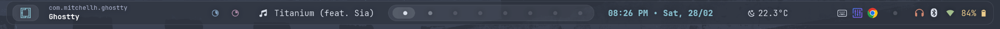

<h1 align="center">✧ Omarchy Waybar ✧</h1>

<div align="center">
  
  <br>
  <i>A sleek, modern, and highly functional Glassmorphism Waybar configuration for Hyprland.</i>
  <br><br>
  <a href="#features">Features</a> •
  <a href="#installation">Installation</a> •
  <a href="#customization">Customization</a> •
  <a href="#dependencies">Dependencies</a>
</div>

---

## ✨ Features

- **🎨 Glassmorphism Aesthetic**: Translucent backgrounds (`alpha 0.7`), rounded corners (`12px`), and a clean, modular layout with refined border accents.
- **🪟 Active Window**: Dynamic, dual-line window display showing application class and truncated title, with special formatting for apps like Discord.
- **🕒 Smart Clock**: Detailed tooltips with a full calendar view and 12-hour format.
- **🌡️ Live Weather**: Real-time updates via OpenWeatherMap API with a detailed 8-line forecast tooltip.
- **🔋 Power Management**: Battery status with progressive charging animations and critical state warnings.
- **🎵 Advanced Media Player**: Deep `playerctl` integration with:
    - **Dynamic Icons**: Unique icons for Spotify, Browsers, and VLC.
    - **Visual Progress**: A beautiful `━━●──` progress bar in the tooltip with live time tracking.
    - **Adaptive Themes**: The player UI automatically changes accents (e.g., Spotify Green) based on the active player.
    - **Rich Tooltips**: Multi-line metadata cards showing Title, Artist, Album, and Playback Status.
    - **Interactive**: Click to Play/Pause, Scroll to Skip/Previous tracks.
- **📊 System Monitoring**: CPU and Memory usage visualized with dynamic "block" icons and `btop` integration on click.
- **🚀 Omarchy Ecosystem**: Deeply integrated with `omarchy-menu`, updates, and system-wide theme settings.

## 🛠️ Installation

### 1. Clone the repository

```bash
git clone https://github.com/azeemali14/waybar-config.git
cd waybar-config
```

### 2. Configure Weather (Optional)

Create a `.env` file in your waybar directory:

```bash
echo 'WEATHER_API_KEY="your_api_key_here"' > ~/.config/waybar/.env
echo 'WEATHER_CITY="your_city_name"' >> ~/.config/waybar/.env
```

### 3. Run the installer

```bash
chmod +x install.sh
./install.sh
```

## 📦 Dependencies

To ensure all modules work correctly, please install the following:

- **Fonts**: `JetBrainsMono Nerd Font`
- **Core**: `waybar`, `jq`, `hyprctl`, `playerctl`, `curl`, `pamixer`
- **Recommended**: `btop` (for system monitoring click actions), `network-manager-applet` (for tray)
- **Ecosystem**: `omarchy-menu`, `omarchy-update` (for full branding integration)

## ⚙️ Customization

- **Layout**: Modify `config.jsonc` to rearrange modules in `modules-left`, `modules-center`, or `modules-right`.
- **Colors**: The configuration imports `@import "../omarchy/current/theme/waybar.css";`. You can override colors manually in `style.css`.
- **Weather**: Update your city and API key in `~/.config/waybar/.env`.
- **Window Title**: Adjust `MAX_TITLE_LEN` in `window.sh` to change how much text is displayed.

---

<div align="center">
  <sub>Built with ❤️ for the Hyprland community by Azeem Ali.</sub>
</div>
