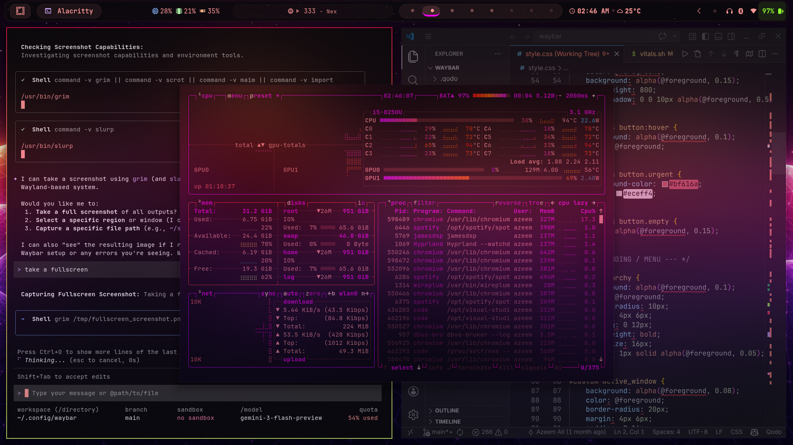
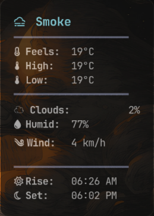
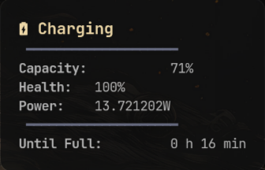
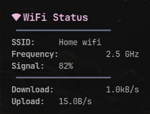
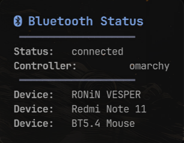
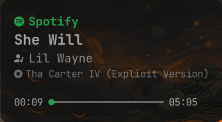
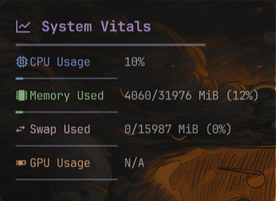

<h1 align="center">
  ✨ Omarchy Waybar ✨
</h1>

<p align="center">
  <i align="center">A high-performance, glassmorphism-inspired Waybar configuration for Hyprland.</i>
</p>

<p align="center">
  
  
  
  
</p>

<div align="center">
  <a href="#-features">Features</a> •
  <a href="#-interactive-installer">Installation</a> •
  <a href="#-tooltips">Gallery</a> •
  <a href="#-dependencies">Dependencies</a> •
  <a href="#-customization">Customization</a>
</div>

<h1 align="center">
  <br>
  
  <br>
</h1>
---

## 🚀 Quick Install

To install this configuration with a single command, run:

```bash
bash -c "$(curl -fsSL https://raw.githubusercontent.com/AzeemAli14/waybar-config/main/install.sh)"
```

<!-- > **Note:** Replace `yourusername` with your actual GitHub username once you've pushed this repository! -->

---

## 🎨 Design Philosophy

**Omarchy Waybar** isn't just a status bar; it's a dashboard for your desktop. Built with a focus on **Glassmorphism**, it features:
- 🧊 **Refined Transparency**: 70% opacity with subtle border glows.
- 🌈 **Adaptive Accents**: Colors that shift based on your active media.
- 🛠️ **Functional Tooltips**: Every icon hides a mini-dashboard with detailed insights.
- 📥 **Collapsible Tray**: A sleek, animated drawer for system tray icons.
- 💊 **Pill Styling**: Modern, pill-shaped active window indicators for a cleaner look.

---

## ✨ Features

### 🌤️ Pro Weather Engine (Enhanced)
- **wttr.in Integration**: Switched to `wttr.in` for superior real-time accuracy (no API key required!).
- **High/Low Accuracy**: Pulls from 24-hour forecasts to show actual daily ranges.
- **Precision Data**: 1-decimal "Feels Like" accuracy to see subtle climate shifts.
- **Offline Mode**: Automatically caches data for view when you're disconnected.
- **Auto-Sync**: Refreshes every hour or on-click.
- **Perfect Alignment**: Monospaced, pixel-perfect layout for all weather vitals.

### 🎵 Advanced Media Control
- **Smart Labels**: Unique icons for Spotify, VLC, and expanded Web Browser support (Zen, Waterfox, Mullvad, Epiphany, and more).
- **Dynamic Styling**: The bar glows with "Spotify Green" or "YouTube Red" based on active media.
- **Rich Dashboards**: Tooltips show high-res progress bars (`━━●──`).

### 📊 System Vitals & Network
- Monitor **CPU**, **RAM**, **Swap**, and **GPU** in one place.
- **Hybrid GPU Monitoring**: Real-time tracking for **NVIDIA**, **Intel**, and **AMD** GPUs (automatically detects active card).
- **Real-time Network**: Download and Upload speeds with progress bars integrated into the vitals tooltip.
- Monospace-aligned progress bars for perfect visual symmetry.
- Click to launch `btop` for deep-dive analysis.

### 🪟 Smart Window Titles
- **Concise Titles**: Automatically extracts filenames from long strings (especially optimized for **VS Code**).
- **Clean Interface**: Shows the App Name in the bar while keeping the filename in the tooltip.

---

## 🛠️ Installation

### Quick Install (Piping to Bash)
To install this configuration with a single command, run:
```bash
bash -c "$(curl -fsSL https://raw.githubusercontent.com/AzeemAli14/waybar-config/main/install.sh)"
```

### Manual Installation
To install with the full visual experience, run:
```bash
git clone https://github.com/AzeemAli14/waybar-config.git ~/.config/waybar
cd ~/.config/waybar
chmod +x install.sh
./install.sh
```

> **Note:** The installer will prompt you for your **Location (City)** to configure the weather module.

---

## ⚙️ Configuration

### Weather Location
To change your city after installation, you can either edit the `.env` file or run the installer with the reconfig flag:
```bash
~/.config/waybar/install.sh --reconfig
```

---

## 📸 Tooltips

| **Weather Forecast** | **Battery Health** | **Network Vitals** |
| :---: | :---: | :---: |
|  |  |  |
| **Bluetooth Status** | **Audio Dashboard** | **System Vitals** |
|  |  |  |

---

## 📦 Dependencies

Ensure these are installed for the full experience:

| Type | Packages |
| :--- | :--- |
| **Core** | `waybar`, `jq`, `curl`, `awk`, `procps` (`top`, `free`) |
| **Media** | `playerctl`, `pamixer` |
| **System** | `btop`, `hyprctl`, `nvidia-smi` (optional for NVIDIA users) |
| **Fonts** | `JetBrainsMono Nerd Font` (Required for Icons) |

---

<div align="center">
  <!-- <sub>Crafted with ❤️ by the Omarchy Team</sub><br> -->
  <sub><i>"Simplicity is the ultimate sophistication."</i></sub>
</div>
